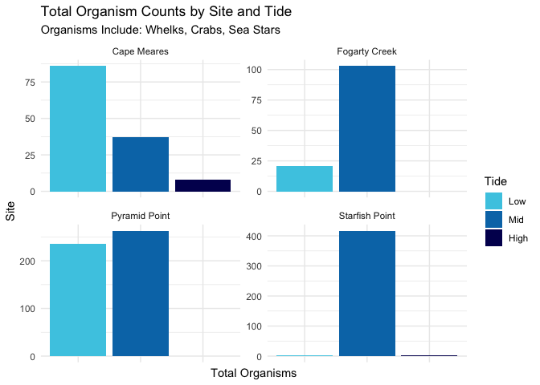

Week09bHomework
================
Megan Smith
2024-10-30

Below is the code and figures for Week 9b Homework

# Load Libraries

``` r
library(tidyverse)
library(here)
library(janitor)
```

# Load in data

``` r
intide_data<- read_csv(here("Week_09", "data", "intertidaldata.csv"))
```

# Inspect Data

``` r
glimpse(intide_data)
```

    ## Rows: 450
    ## Columns: 13
    ## $ Site                  <chr> "Scripps", "Scripps", "Scripps", "Scripps", "Scr…
    ## $ Transect              <dbl> 1, 1, 1, 2, 2, 2, 3, 3, 3, 4, 4, 4, 5, 5, 5, 6, …
    ## $ Quadrat               <chr> "Low  .", "Mid", "High", "Low", "Mid", "High", "…
    ## $ `Bare Rock`           <dbl> 25, 50, 20, 10, 40, 40, 0, 30, 60, 0, 45, 70, 5,…
    ## $ Algae                 <dbl> 75, 0, 50, 85, 5, 5, 100, 5, 4, 100, 10, 0, 70, …
    ## $ Mussels               <dbl> 0, 5, 1, 0, 10, 0, 0, 10, 1, 0, 3, 0, 0, 5, 0, 0…
    ## $ `Small Barnacles`     <dbl> 2, 50, 50, 0, 40, 55, 0, 40, 20, 0, 25, 25, 20, …
    ## $ `Large Barnacles`     <dbl> 5, 5, 0, 0, 1, 0, 1, 0, 0, 0, 15, 5, 5, 0, 0, 5,…
    ## $ `Gooseneck Barnacles` <dbl> 0, 0, 0, 5, 5, 0, 0, 30, 5, 0, 0, 0, 0, 0, 0, 0,…
    ## $ Anemone               <dbl> 3, 0, 0, 0, 0, 0, 0, 0, 0, 0, 5, 0, 0, 10, 0, 0,…
    ## $ `Whelks (Counts)`     <dbl> 0, 0, 0, 0, 0, 0, 0, 0, 1, 0, 0, 0, 0, 1, 0, 0, …
    ## $ `Crabs (Counts)`      <dbl> 0, 0, 0, 0, 0, 0, 0, 0, 0, 0, 0, 0, 0, 0, 0, 0, …
    ## $ `Stars (Counts)`      <dbl> 0, 0, 0, 0, 0, 0, 0, 0, 0, 0, 0, 0, 0, 0, 0, 0, …

# Clean Data

``` r
intide_clean<-intide_data %>% # cleaning column and  quadrat names
  clean_names() %>% # using the janitor package to clean column names
  mutate(quadrat = str_replace(quadrat, "^(Low|Mid|High).*", "\\1")) #trying to use regex more often
head(intide_clean)
```

    ## # A tibble: 6 × 13
    ##   site  transect quadrat bare_rock algae mussels small_barnacles large_barnacles
    ##   <chr>    <dbl> <chr>       <dbl> <dbl>   <dbl>           <dbl>           <dbl>
    ## 1 Scri…        1 Low            25    75       0               2               5
    ## 2 Scri…        1 Mid            50     0       5              50               5
    ## 3 Scri…        1 High           20    50       1              50               0
    ## 4 Scri…        2 Low            10    85       0               0               0
    ## 5 Scri…        2 Mid            40     5      10              40               1
    ## 6 Scri…        2 High           40     5       0              55               0
    ## # ℹ 5 more variables: gooseneck_barnacles <dbl>, anemone <dbl>,
    ## #   whelks_counts <dbl>, crabs_counts <dbl>, stars_counts <dbl>

# Selecting sampling locations

``` r
selectsites<-intide_clean %>% 
  filter(site %in% c("Starfish Point", "Pyramid Point", "Fogarty Creek", "Cape Meares")) %>% # these had over 100 total organisms
  pivot_longer(cols= whelks_counts:stars_counts, #pivoting longer to add all organisms
               names_to = "Organisms",
               values_to = "Values") %>% 
  group_by(site, Organisms, quadrat) %>% 
  mutate(quadrat = factor(quadrat, levels= c("Low", "Mid", "High"))) %>%  # making low, medium and high factors 
  summarise(Total_Organisms = sum(Values, na.rm= TRUE))# summarizing total organisms 
```

# Creating a plot

``` r
ggplot(selectsites, aes(x = Total_Organisms, y=quadrat, fill= quadrat)) +
  geom_bar(stat = "identity") +  # barplot to show total organisms 
  labs(title = "Total Organism Counts by Site and Tide",
       subtitle = "Organisms Include: Whelks, Crabs, Sea Stars",
       x = "Site",
       y = "Total Organisms",
       fill= "Tide") +
  scale_fill_manual(values= c("#48cae4", "#0077B6","#03045E"))+ # selecting colors
  theme_minimal() +
  theme(legend.position = "right",  
        axis.text.x = element_blank()) + #removing x axis for clarity
  coord_flip() + #flipping the axis
  facet_wrap(~ site, scales= "free") # faceting by site and making scales free for clarity
```

<figure>

<figcaption aria-hidden="true">Total Organism Counts</figcaption>
</figure>
